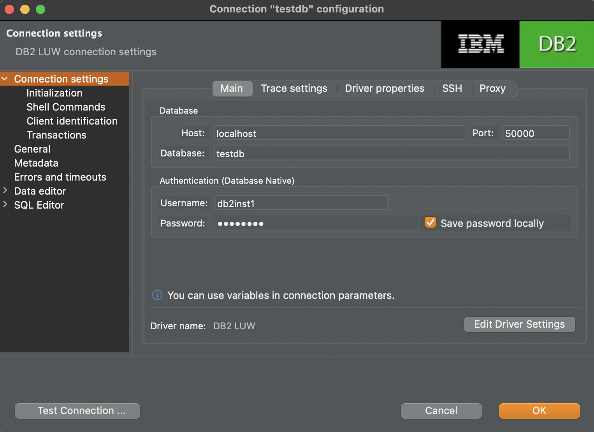

# DB2

## Start service

```
docker run -h db2server --name db2server --restart=always --detach --privileged=true \
    -p 50000:50000 --env-file .env_list -v db:/database ibmcom/db2
```

## Connect with DBeaver




## Resource

- https://www.ibm.com/docs/en/db2/11.5?topic=SSEPGG_11.5.0/com.ibm.db2.luw.qb.server.doc/doc/t_install_db2CE_win_img.html